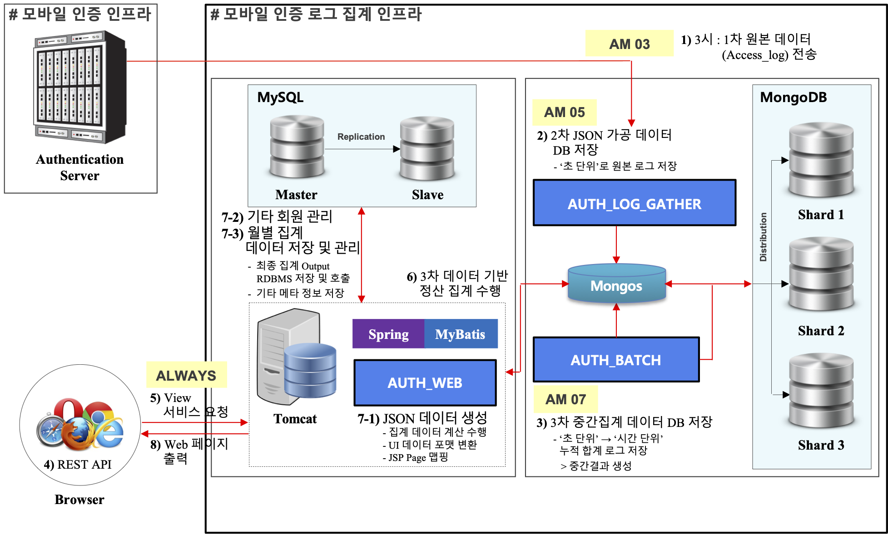
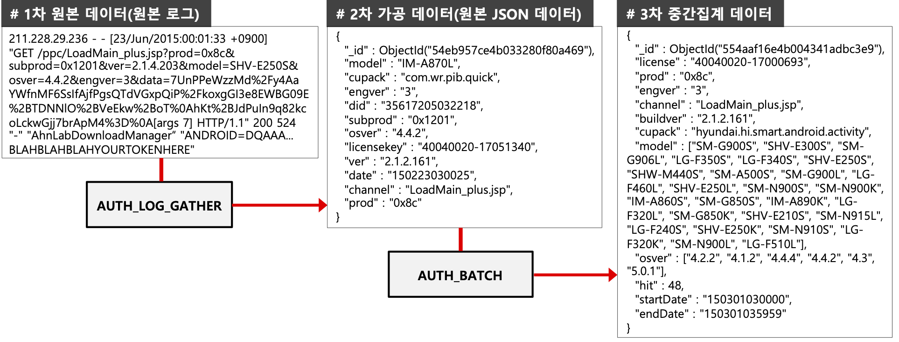
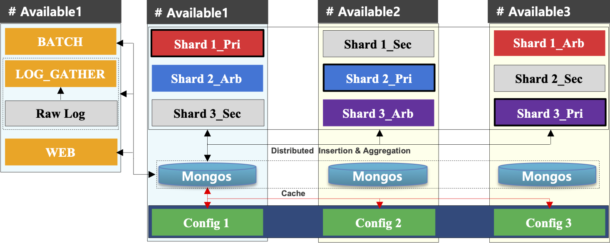
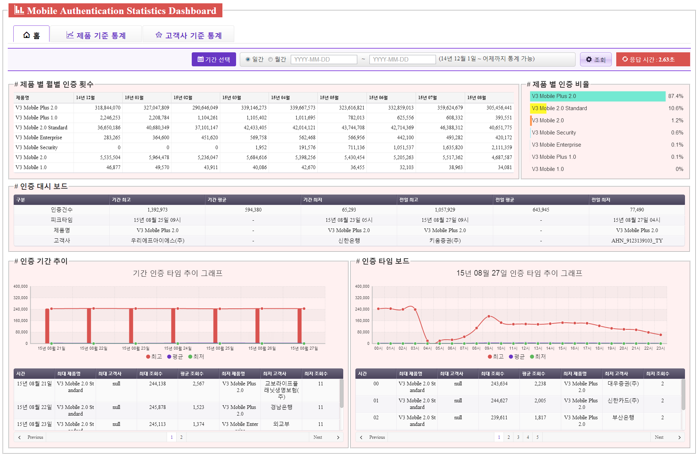
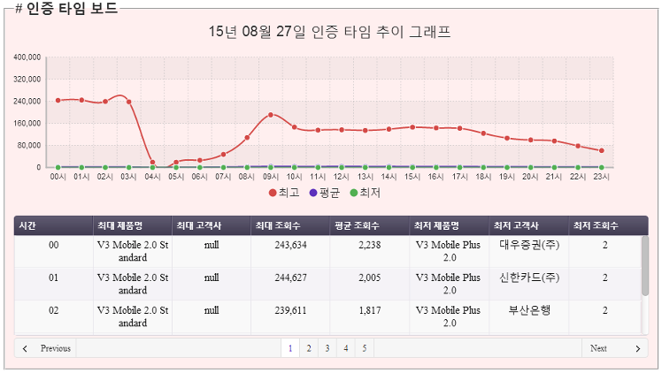
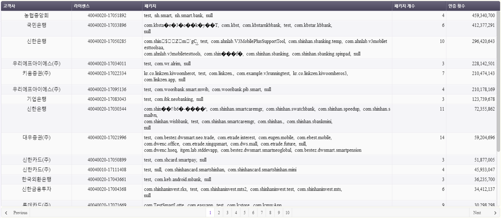
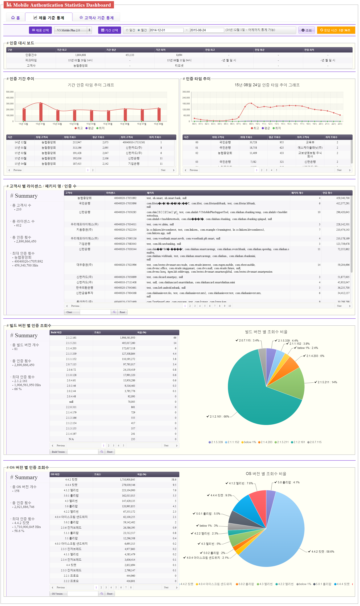
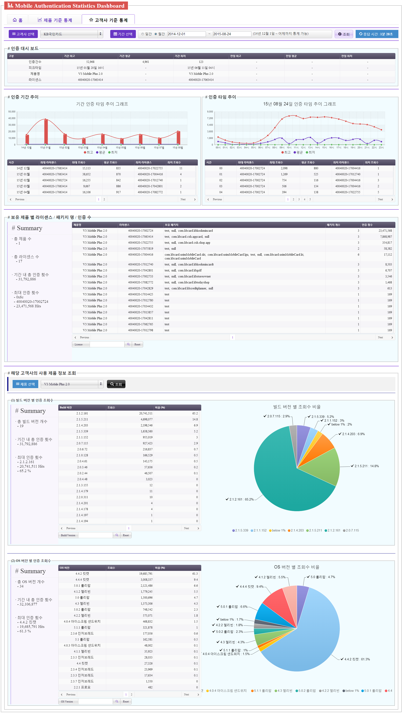

## 1. 모바일 제품 인증 로그 통계 시스템
* 직무 : 'V3 모바일 제품군' 인증 웹 로그 집계 및 분석 웹 서비스 설계, 개발, 운영
* 요약
    - V3 모바일 애플리케이션을 실행할 경우, 해당 단말 정보를 기반으로 '인증서버'에 인증을 하게 된다. 인증 수행 시 서버에 남은 API 로그를 파싱하여 필요한 데이터를 가공 및 DB화하고, 이를 기반으로 구글 애널리틱스와 같이 다각적 통계 분석 데이터(e.g. '제품별', '고객사별' 사용률 추이)를 볼 수 있는 대시보드 웹 서비스이다.
* 기간 : 2015.01 ~ 2015.12
* 기술 : Linux, Tomcat, Java, Spring Framework, JSP, jQuery, JavaScript, MongoDB
* 역할
    - 데이터 수집, 집계 배치 애플리케이션 개발
    - MongoDB Sharding 구현
    - 웹 콘솔 구현
    - 서버 및 웹 보안점검, 운영, 유지보수
* 성과 
    1. 모바일 제품 사업 방향성 협의를 위한 분석 데이터 제공 및 시각화
        + e.g. '제품별', '고객사별', '라이센스별', '제품빌드버전별', 'OS별' 등 다각적 사용률 통계 조회
    2. 대용량 데이터 분산 처리, 가공 시간 개선
        + 원본 로그 대비 집계(계산) 데이터 용량 감축 : 99%(한달 기준 1.5TB -> 11GB)
        + 계산 처리 시간 개선 : 전체 데이터 계산 기준, ∞ (기존에는 불가능) -> 5분 이내 소요

### 1.1. 아키텍처
#### (1) Infra

* **AUTH_LOG_GATHER (로그 수집기)**
    - '모바일 인증 인프라'에서 V3 Mobile 제품들의 1차 원본 로그 데이터(Access Log)를 수집하여 집계 필요·중요 데이터(Key-Value) 추출함으로써, 1차 원본 로그데이터 사이즈 대비 72%를 감소시킨 2차 가공 데이터(JSON 형태) 생성한다. 
* **AUTH_BATCH (로그 배치)**
    - 실시간 기반 2차 가공 데이터를 시간 단위로 압축 및 중간합산을 수행함으로서 2차 데이터 사이즈 대비 99%를 감소시킨 3차 중간집계 데이터 생성한다. 
* **AUTH_WEB (집계 웹)**
    - 3차 중간집계 데이터 기반으로 요구사항 집계처리 및 뷰를 생성함으로서 기존에 산정불가능 했던 통계 View 생성시간을 5분 내외로 감소시킨다. 

#### (2) DB

### 1.2. 화면
#### (1) 메인

#### (2) 제품 기준 통계

#### (3) 고객사 기준 통계

