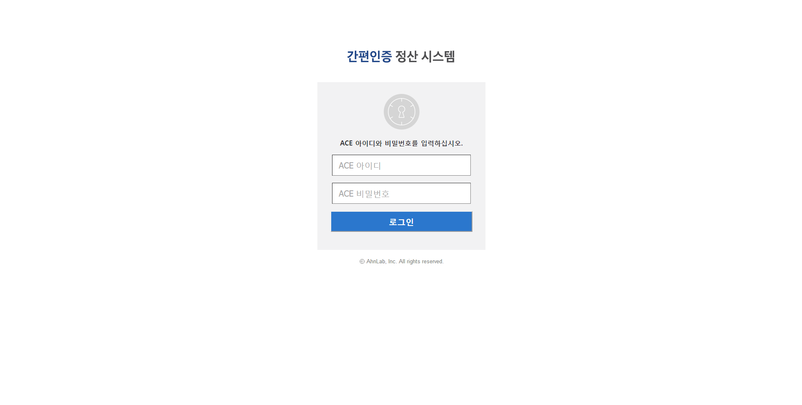

## 2. 간편인증 서비스 이용 과금 정산 시스템
* 직무 : '안랩 간편 인증 서비스' 이용 과금 정산 및 발급 웹 서비스 설계, 개발, 운영
* 요약
    - '안랩 간편인증 서비스'는 '모바일 단말에서 개인 통합 인증'을 수행해주는 서비스이다. 인증 수행 시 서버에 남은 API 로그를 파싱하여 필요한 데이터를 가공 및 DB화하고, 이를 기반으로 1) 해당 서비스를 제공하는 '안랩', 2) 개인정보 및 암호화 통신을 중개해주는 '통신사', 3) 해당 서비스를 이용하는 '고객사'에게 각자 할당된 비율로 사용과금을 정산해주는 웹 서비스이다.
* 기간 : 2015.10 ~ 2015.12
* 기술 : Linux, Tomcat, Java, Spring Framework, JSP, jQuery, JavaScript, MongoDB
* 역할
    - 데이터 수집, 집계 배치 애플리케이션 개발
    - MongoDB Sharding 구현
    - 웹 콘솔 구현
    - 서버 및 웹 보안점검, 운영, 유지보수
* 성과
    - '사내', '통신사(SKT, KT, LGU+)', '서비스 이용 고객사' 3사에 서비스 과금 정산 데이터 제공 및 시각화, 영수증 발급
        + 로그 집계 및 계산을 통한 정산 처리 및 대시보드 시각화
        + 월별 정산 금액 명세서 출력 및 PDF 발급
        + 월별 정산 원본 로그 발급

### 2.1. 아키텍처
#### (1) Infra

##### 통신사 데이터 모델링

##### 고객사 JSON 모델링

#### (2) DB

 

### 2.2. 화면
#### (1) 로그인

 

#### (2) 이통사 수수료 정산

 

#### (3) 고객사 인증 사용료 정산

 

#### (4) 고객사 등록관리

