## 1. 모바일 제품 인증 로그 통계 시스템
* 직무 : 'V3 모바일 제품군' 인증 웹 로그 집계 및 분석 웹 서비스 설계, 개발, 운영
* 요약
    - V3 모바일 애플리케이션을 실행할 경우, 해당 단말 정보를 기반으로 '인증서버'에 인증을 하게 된다. 인증 수행 시 서버에 남은 API 로그를 파싱하여 필요한 데이터를 가공 및 DB화하고, 이를 기반으로 구글 애널리틱스와 같이 다각적 통계 분석 데이터(e.g. '제품별', '고객사별' 사용률 추이)를 볼 수 있는 대시보드 웹 서비스이다.
* 기간 : 2015.01 ~ 2015.12
* 기술 : Linux, Tomcat, Java, Spring Framework, JSP, jQuery, JavaScript, MongoDB
* 역할
    - 데이터 수집, 집계 배치 애플리케이션 개발
    - MongoDB Sharding 구현
    - 웹 콘솔 구현
    - 서버 및 웹 보안점검, 운영, 유지보수
* 성과 
    1. 모바일 제품 사업 방향성 협의를 위한 분석 데이터 제공 및 시각화
        + e.g. '제품별', '고객사별', '라이센스별', '제품빌드버전별', 'OS별' 등 다각적 사용률 통계 조회
    2. 대용량 데이터 분산 처리, 가공 시간 개선
        + 원본 로그 대비 집계(계산) 데이터 용량 감축 : 99%(한달 기준 1.5TB -> 11GB)
        + 계산 처리 시간 개선 : 전체 데이터 계산 기준, ∞ (기존에는 불가능) -> 5분 이내 소요

### 1.1. 아키텍처
#### (1) Infra

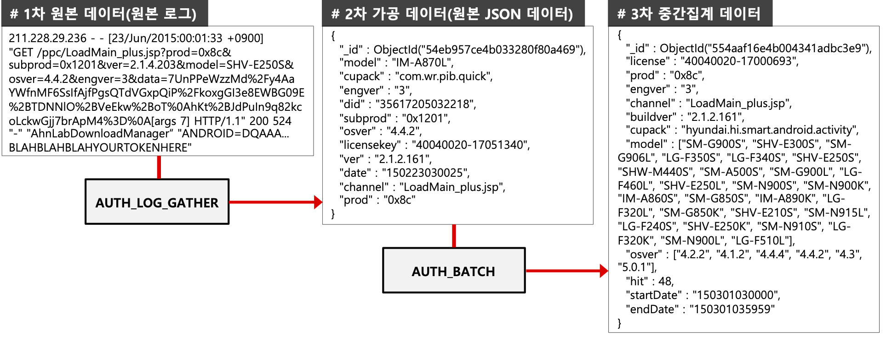

* **AUTH_LOG_GATHER (로그 수집기)**
    - '모바일 인증 인프라'에서 V3 Mobile 제품들의 1차 원본 로그 데이터(Access Log)를 수집하여 집계 필요·중요 데이터(Key-Value) 추출함으로써, 1차 원본 로그데이터 사이즈 대비 72%를 감소시킨 2차 가공 데이터(JSON 형태) 생성한다. 
* **AUTH_BATCH (로그 배치)**
    - 실시간 기반 2차 가공 데이터를 시간 단위로 압축 및 중간합산을 수행함으로서 2차 데이터 사이즈 대비 99%를 감소시킨 3차 중간집계 데이터 생성한다. 
* **AUTH_WEB (집계 웹)**
    - 3차 중간집계 데이터 기반으로 요구사항 집계처리 및 뷰를 생성함으로서 기존에 산정불가능 했던 통계 View 생성시간을 5분 내외로 감소시킨다. 

#### (2) DB
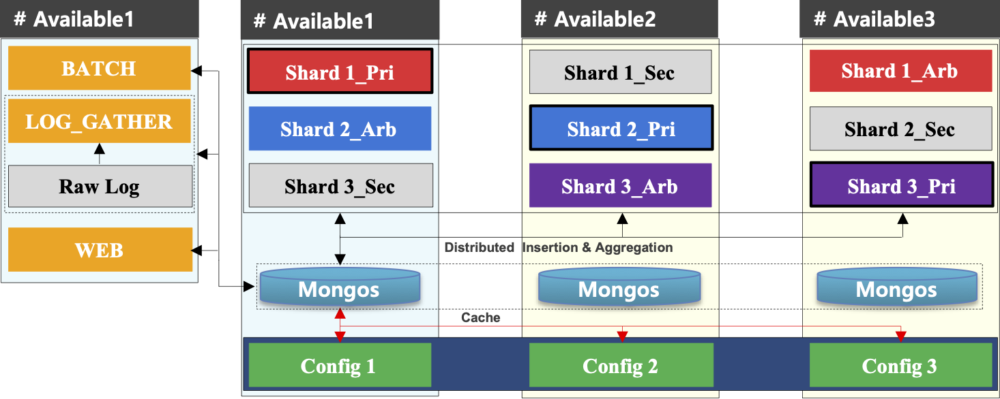

### 1.2. 화면
#### (1) 메인
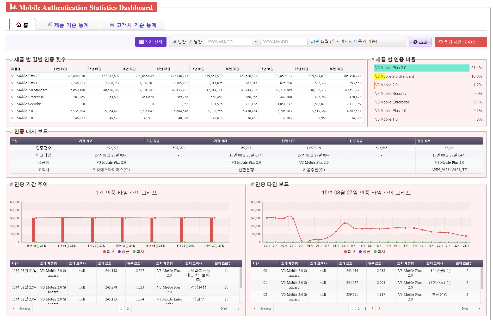
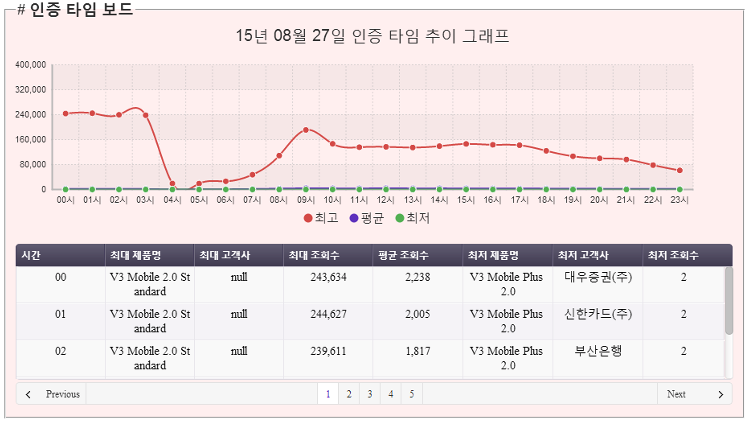

#### (2) 제품 기준 통계
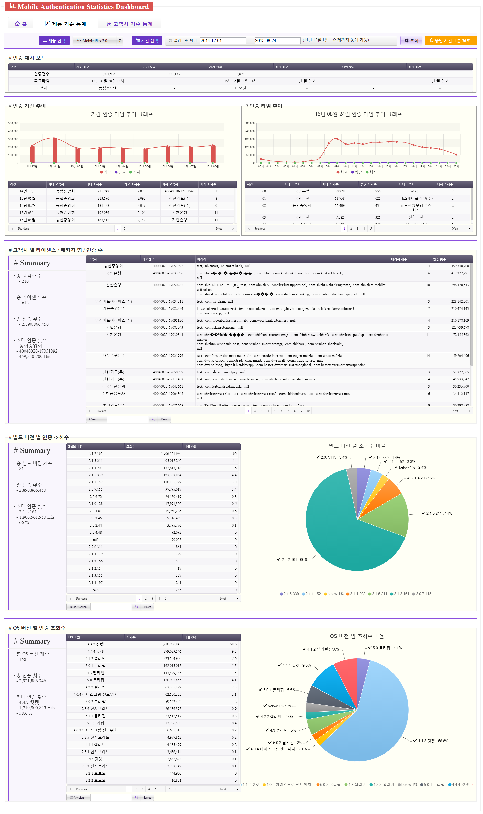

#### (3) 고객사 기준 통계

 

## 2. 간편인증 서비스 이용 과금 정산 시스템
* 직무 : '안랩 간편 인증 서비스' 이용 과금 정산 및 발급 웹 서비스 설계, 개발, 운영
* 요약
    - '안랩 간편인증 서비스'는 '모바일 단말에서 개인 통합 인증'을 수행해주는 서비스이다. 인증 수행 시 서버에 남은 API 로그를 파싱하여 필요한 데이터를 가공 및 DB화하고, 이를 기반으로 1) 해당 서비스를 제공하는 '안랩', 2) 개인정보 및 암호화 통신을 중개해주는 '통신사', 3) 해당 서비스를 이용하는 '고객사'에게 각자 할당된 비율로 사용과금을 정산해주는 웹 서비스이다.
* 기간 : 2015.10 ~ 2015.12
* 기술 : Linux, Tomcat, Java, Spring Framework, JSP, jQuery, JavaScript, MongoDB
* 역할
    - 데이터 수집, 집계 배치 애플리케이션 개발
    - MongoDB Sharding 구현
    - 웹 콘솔 구현
    - 서버 및 웹 보안점검, 운영, 유지보수
* 성과
    - '사내', '통신사(SKT, KT, LGU+)', '서비스 이용 고객사' 3사에 서비스 과금 정산 데이터 제공 및 시각화, 영수증 발급
        + 로그 집계 및 계산을 통한 정산 처리 및 대시보드 시각화
        + 월별 정산 금액 명세서 출력 및 PDF 발급
        + 월별 정산 원본 로그 발급

### 2.1. 아키텍처
#### (1) Infra

##### 통신사 데이터 모델링
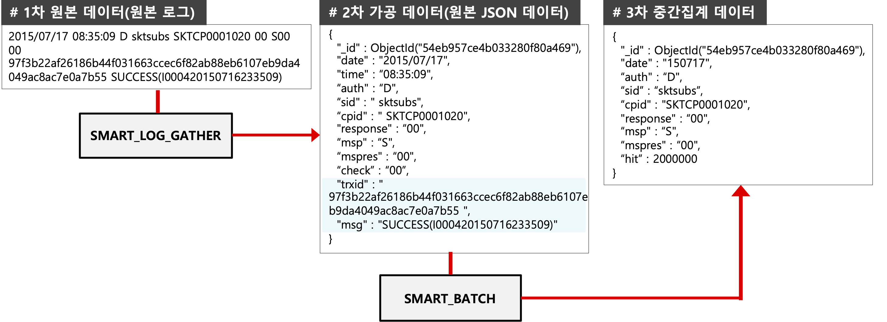

##### 고객사 JSON 모델링
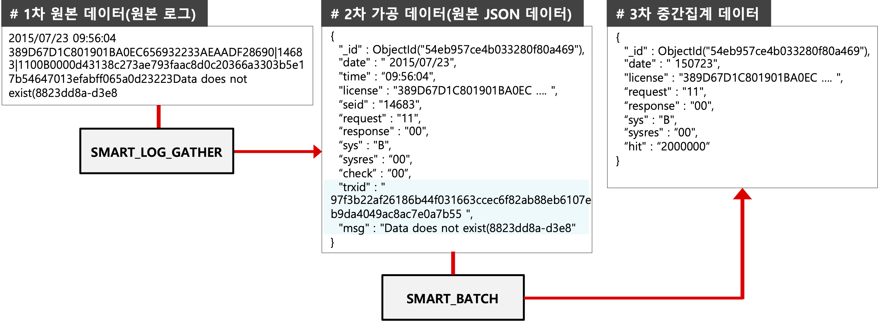

#### (2) DB

 

### 2.2. 화면
#### (1) 로그인

 

#### (2) 이통사 수수료 정산

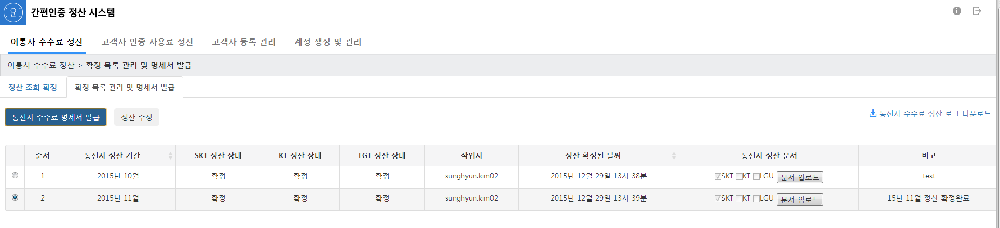

 

#### (3) 고객사 인증 사용료 정산

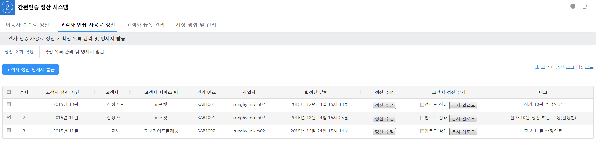
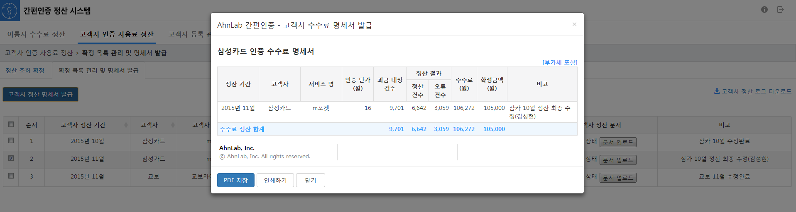

 

#### (4) 고객사 등록관리

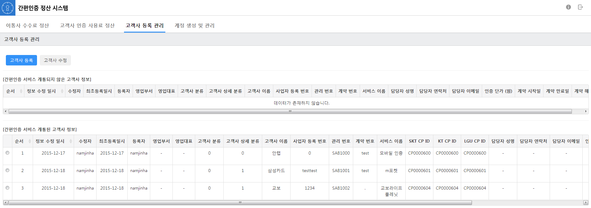

 

## 3. 안리포트 전문 검색 웹 서비스
* 직무
    1. **Ahnreport Server**
        + **`안랩 제품` 및 `고객 PC 보안`에 이상징후 발생 시 '안리포트(해당 고객 PC 및 안랩 제품 실행환경 스냅샷(대용량 텍스트 데이터))'를 수집하고, 수집 데이터들의 전문 검색 서비스 설계, 개발, 운영**
    2. **Ahnreport Issue Detector**
        + **안리포트를 수집 시 제품 및 보안분야 별 이상징후 패턴(Rule-Set) 자동 탐지 수행 후 솔루션 제공 시스템 설계, 개발, 운영**
* 요약
    - 안랩제품 혹은 보안분야 별 이상징후 발생 시 해당 시스템 정보를 담고있는 '안리포트'를 수집한다. 기존에는 이를 수집하여 제품개발팀과 기술지원팀이 해당 리포트를 수동으로 열어서 일일히 원하는 부분을 찾아서 버그 수정 및 기술 지원을 해야했기 때문에, 상대적으로 업무 처리속도와 불편함이 많았다. 그래서 이러한 리포트들을 한 곳에 모아 1) 내가 원하는 키워드를 갖는 리포트들을 검색할 수 있고, 그리고 2) 해당 리포트 안에서 원하는 키워드들을 쉽고 빠르게 검색할 수 있는 전문검색 웹 서비스를 개발하였다. 
    - 또한 '리포트에서 일정 키워드 패턴들이 존재할 경우, 항상 특정 이슈가 발생했었고 이렇게 대응을 했다.'라는 이슈들이 계속 반복 및 누적되면서 특정 키워드 패턴 조합을 자동 분석하고 이에 대한 '대응 보고서'를 생성해주는 시스템을 개발하였다.
    - 인프라 구축 자동화(CI)를 위해 Ansible을 사용하였으며, 애플리케이션 배포 자동화(CD)를 위해 도커 기반 컨테이너 오케스트레이션 플랫폼(Docker, Rancher), Jenkins를 구축하여, 전체 시스템 인프라 구축 및 운영 프로세스를 자동화하였다.
* 기간 : 2016.01 ~ 2019.01
* 기술 : Linux, JavaScript, Node.js, Nginx, Swagger, Java, Elasticsearch(ELK Stack), Docker, Rancher, Ansible, Jenkins
* 역할
    - 안리포트 수집 및 저장 처리
    - 안리포트 분산 저장 및 전문 검색 구현
    - 웹 콘솔 구현
    - 안리포트 이상징후 자동 탐지 시스템
    - CI/CD 개발
    - 서비스 모니터링 시스템 구축
    - 서버 및 웹 보안점검, 운영, 유지보수
* 성과
    - 리포트들의 '전문검색 웹 서비스', '이상징후 자동 탐지 및 솔루션 제공', '기타 서비스(e.g. 리포트 다운로드 등)'을 전사 내에 제공함으로써 제품 개발팀 및 기술지원팀의 대응 업무 프로세스 개선
    - 리포트 수집 시 자동으로 이상 징후 감지 및 해결책을 제공함으로써, 제품개발팀 및 기술지원팀의 대응 업무 프로세스 개선
    - CI/CD 구축으로 인한 인프라 프로비저닝 체계화

 

### 3.1. AhnReport Server
#### 3.1.1. Infra

 

#### 3.1.2. Function & View
#### (1) 전문검색

* 통합검색 : 수집된 리포트 Fulltext 검색 및 Key-Value 기반 검색
* 고급검색 : 입력된 조건을 파싱하여, 다양한 형태의 Elasticsearch Query DSL 변환 및 질의 수행

 

#### 1) 특정 컴퓨터에서 수집된 모든 AhnReport 보기

#### 2) “대한전자”가 있는 AhnReport 보기

#### 3) “대한전자”와 “ABCD.exe”가 있는 AhnReport 보기

#### 4) Windows 7이고, 메인보드가 “440BX”로 시작하는 AhnReport 보기

#### 5) 최근 일주일간 시작프로그램에 새 프로그램이 등록된 AhnReport

 

#### (2) 검색어 입력방법
#### 1) 통합검색
##### 조건 검색
* 안리포트 서버는 사용자의 Text 키워드 입력 기반 검색뿐만 아니라 추가 검색 조건을 제공한다.
    - 검색 조건 : 보고자(한글 또는 안방 계정), 지원 ID, Machine ID, Works Key, 접수 경로, 접수 날짜, 접수 구분, 운영체제
* 예제 : 특정 컴퓨터에서 수집된 AhnReport 검색
    

 

##### Value 검색
* 안리포트 JSON 파일의 Value에 대해 단어(문장) 검색을 수행하며, 기본적인 검색 지원은 다음과 같다.
    - 1) 대소문자 구분하지 않음
        
    - 2) 공백 및 특수문자를 포함한 정확한 문장 검색
        
    - 3) AND / OR / NOT(-) 검색 지원 
        

 

##### Key - Value 검색
* 안리포트 JSON 파일의 정확한 Key - Value에 대한 검색을 수행하며, 기본적인 검색 지원은 다음과 같다.
* 단어(문장)
    - 1) 포함 및 미포함
        + 특정 키의 값에 대해서 지정 단어(문장)을 포함(미포함)하는 안리포트 파일 검색
            
    - 2) 일치 및 불일치
        + 특정 키의 값에 대한 지정 단어(문장)의 정확한 일치(불일치)하는 안리포트 파일 검색
            
    - 3) 시작 및 끝
        + 특정 키의 값에 대한 지정 단어(문장)의 시작 및 끝맺는 안리포트 파일 검색
            
    - 4) 비교
        + 숫자(Number), 날짜(Date), 단어(String)에 대해서 비교연산을 제공한다.
        + 비교 문법  
            
            
* 검색 범위 제한
    - 전체 안리포트 데이터 중 검색 범위를 제한한다.
        

 

#### 2) 고급검색
고급 검색에서는 ElasticSearch의 검색 Query 문(Query DSL)을 이용하여 다양함 검색 기능(Nested Query, Exists Query 등)을 지원한다.

##### Nested Query
* 특정 키의 값(배열)에 대해 정확한 배열 요소를 찾아낸다. 
    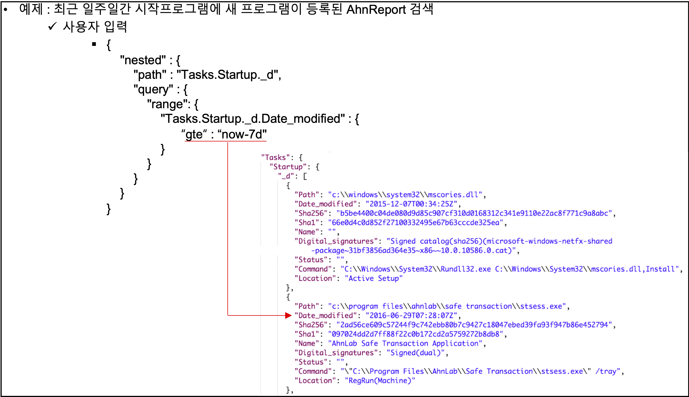

 

##### Exists Query
* 특정 키와 값에 대해서 존재 유무를 판별한다.
    

 

##### 기타 쿼리
* 이외 검색 Query 문은 아래의 링크 참조
    - https://www.elastic.co/guide/en/elasticsearch/reference/current/query-dsl.html

 

#### (3) 리포트 상세보기
#### 1) 리포트 상세 트리 검색

#### 2) 수집 파일 다운로드
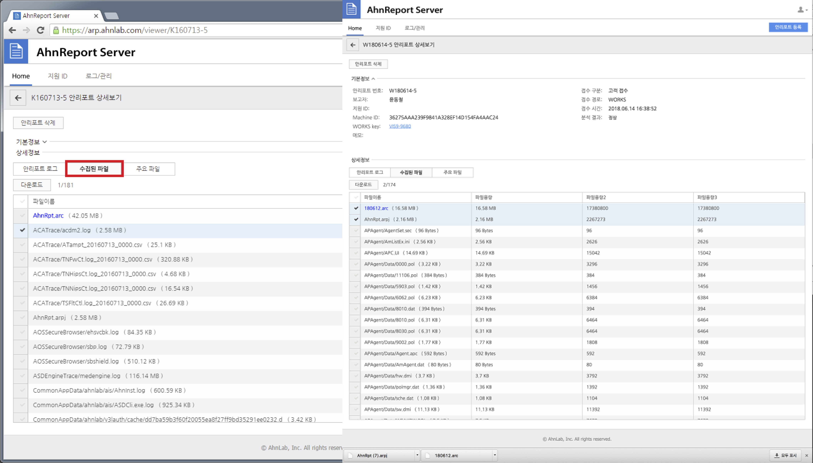

#### 3) 주요 파일 악성데이터(Blacklist) & 정상데이터(Whitelist) 탐지 조회 – ASD, NFS 조회

 

#### (4) 안리포트 등록
#### 1) 웹 콘솔에서 등록

#### 2) Jira Works에서 등록
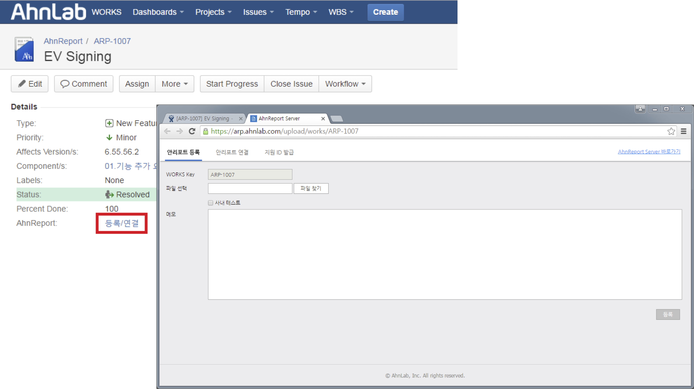

 

#### (5) JIRA Works 연동
#### 1) WORKS에서 AhnReport 연결

#### 2) 상세 보기에서 WORKS 연결
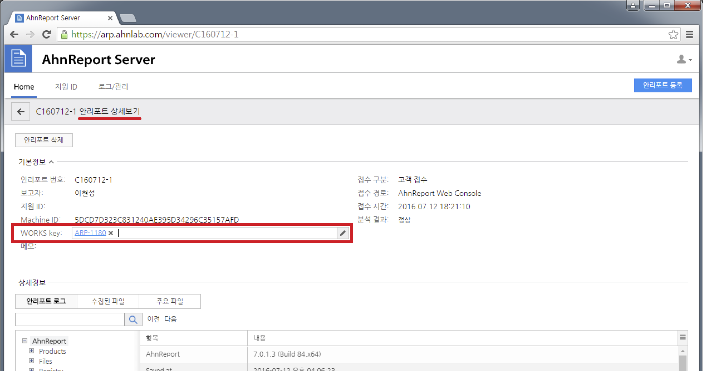

#### 3) 연동 이후 댓글 알림

  

#### (6) CI/CD

 

#### (7) Monitoring

### 3.2. AhnReport Issue Detector
#### 3.2.1. 개요
#### (1) 정의
* **AhnReport Issue Detector (AID)**
    - 수집된 안리포트에서 제품(Product) 및 보안(Security) 분야별 알려진 이슈(Known Issue)에 대한 1) 탐지, 2) 해결책 제시 → 대응속도, 업무효율화를 향상 시키는 시스템
* **Rule-Set**
    - 알려진 이슈에 대한 탐지 규칙, 해결책을 정의한 데이터 셋

#### `Rule-Set 문법을 알면 안리포트 내의 모든 데이터 내의 특정 패턴을 검색할 수 있는 범용 인터페이스`

#### (2) 처리 프로세스

#### (3) 예시
* 패턴 정의
    - “HKLM\SYSTEM\CurrentControlSet\Control\Session Manager\Memory Management” Key에 PagedPoolSize 컬럼이 존재하지 않는 경우, “Driver가 정상적으로 동작하지 않는 문제”가 빈번히 있었다.
* Rule-Set  
    

#### 3.2.2. Appliaction Architecture

#### 3.2.3. Rule-Set
#### (1) Format

 

#### (2) 작성규칙
#### 1) 기본정보

* Rule-Set의 기본(기타)정보
* Key-Value 종륲
    - name : 이름
    - level : 이슈 중요도
        + White : 정보
        + Yellow : Known Issue일 가능성이 있으므로 확인해 볼 필요가 있음
        + Red : Known Issue
    - description : 설명
    - worksKey : 관련 이슈
    - url : 해결가이드 URL
    - memo : 메모

#### 2) Rule APIs
##### Query API

* 안리포트 분석파일(arpj) 검색 API
* Key-Value 종륲
    - id : Rule API ID
    - api : Rule API Type (query)
    - class : AhnReport Tree 항목
    - \_condition : 해당 class에 대한 상세 조건
    - \_condition.column : class의 Data Column
    - \_condition.property : class의 Property
    - \_condition.op : 연산자
        + 비교연산 : ==, !=, <, <=, >, >=
        + 부분문자열 검색 : match
        + 존재유무 : exist, not_exist
    - \_condition.value : 연산대상 값

##### QueryDSL API

* Elasticsearch QueryDSL로 arpj 검색 API
* Key-Value 종륲
    - api : Rule API Type (querydsl)
    - query : Elasticsearch QueryDSL 객체

##### Script API

* 스크립트 수행 API
* Key-Value 종륲
    - api : Rule API Type (script)
    - type : 사용할(지원하는) Script API
    - op : 연산자
        + type에 따라 지원 연산자가 다름
    - value
        + 연산대상 값

##### FileSearch API

* 안리포트 수집파일(Log File) 검색 API
    - 용어 정리
        + 정보 (Rows) : 한 라인에 해당하는 하나의 정보
        + 항목 (Columns) : 구분자로 나누어진 각 항목
        + 구분자 (Delimiter) : 항목을 나누는 기준

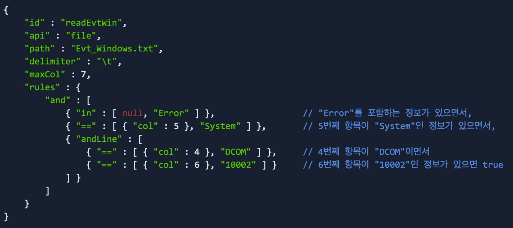

* Key-Value 종륲
* api : Rule API Type (file)
* path
    - 압축 파일(.arc) 내 폴더 경로를 포함한 파일명
    - Ex) CommonAppData/ahnlab/ais/AhnInst.log
* delimiter : 항목 구분자
* maxCol : 최대 항목 인식
* rules : 해당 file에 대한 상세 조건
* rules.{$op} : 연산자
    - 비교연산 : ==, !=, in
    - 논리연산 : and, andLine, or

 

#### 3) 논리표현식

* logicalState  
    - 각 Rule API ID (id) 조합
    - 각 ID의 값은 Bool (True / False)
    - 논리표현식의 값이 True일 경우 → 해당 RuleSet은 필터링됨

 

#### 4) 전체 예시

#### (3) 필터링 결과
**특정 안리포트(특정 이슈)에서 필터링 수행된 Rule-Set 종합리포트를 이슈 코멘트로 추가**

 