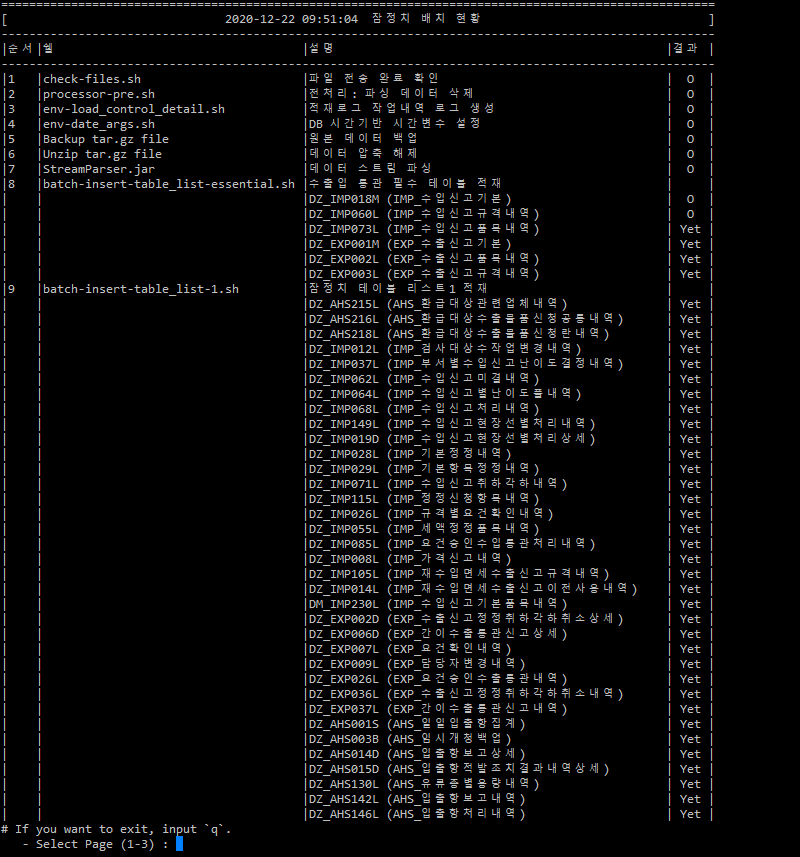
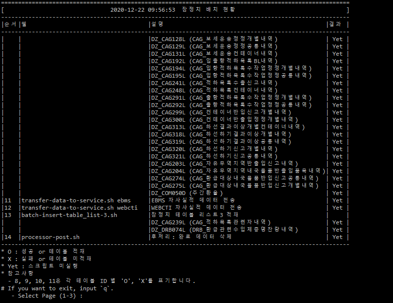
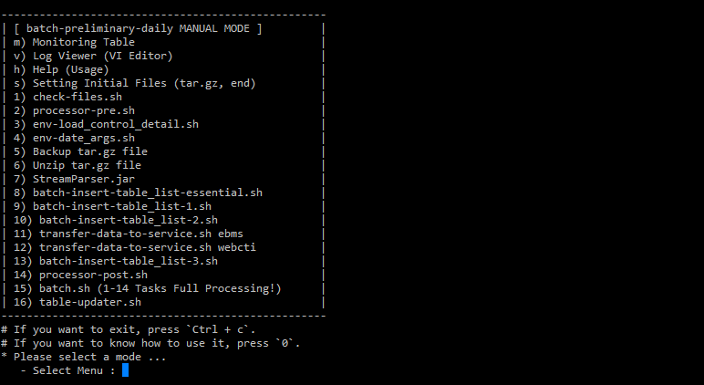

## 1. 통관 데이터 적재 시스템
본 시스템은 관세청에 신고된 수출입 통관 Raw 데이터(Text)를 파싱하여 RDBMS 기초 테이블에 데이터를 적재하는 시스템이며, 다음과 같은 시스템을 개발 및 운영하는 것을 목표로한다. 
> 1. 기존의 비효율적인 혹은 무거운 Legacy 코드, 처리과정에 대한 알고리즘 수정, 코드 리팩토링 및 모듈화 처리함으로서 데이터 적재에 대한 처리속도 향상을 목표로한다.
> 2. 처리과정 모니터링 서비스를 개발함으로서 시스템 장애 발생 시 신속하게 대응할 수 있도록 안전성 및 유지보수 기능을 개선한다.

* 기간 : 2020.03 ~ 2021.03
* 기술
    - Linux, Shell Script, Oracle PL/SQL, Java
* 역할
    - 시스템 개발 및 운영
    - Legacy 코드 수정 및 리팩토링
    - 적재 처리 과정 모니터링 프로그램 개발
    - 각 처리 스텝별 수동 실행 프로그램 개발
    - 적재 처리 오류 발생 시 문자 알림 서비스 개발
    - `Solaris (SunOS)` -> `Linux (CentOS)`로 이관
    - 잠정치 데이터 적재 오류처리 대응 및 유지보수
* 성과
    - 기존 대비 30% 처리속도 개선
    - 통관데이터 적재 처리과정 모니터링 간편화
    - 적재 오류 대응 처리속도 향상
    - 노후화된 OS(Solaris)에서 개발 보편성 및 처리 안전성이 높은 OS(Linux) 이관 검증을 통해, 애플리케이션 처리속도 및 데이터 적재 안정성 증진

### 화면
#### 적재 처리 과정 모니터링 프로그램

#### 각 처리 스텝별 수동 실행 프로그램

#### 처리과정

