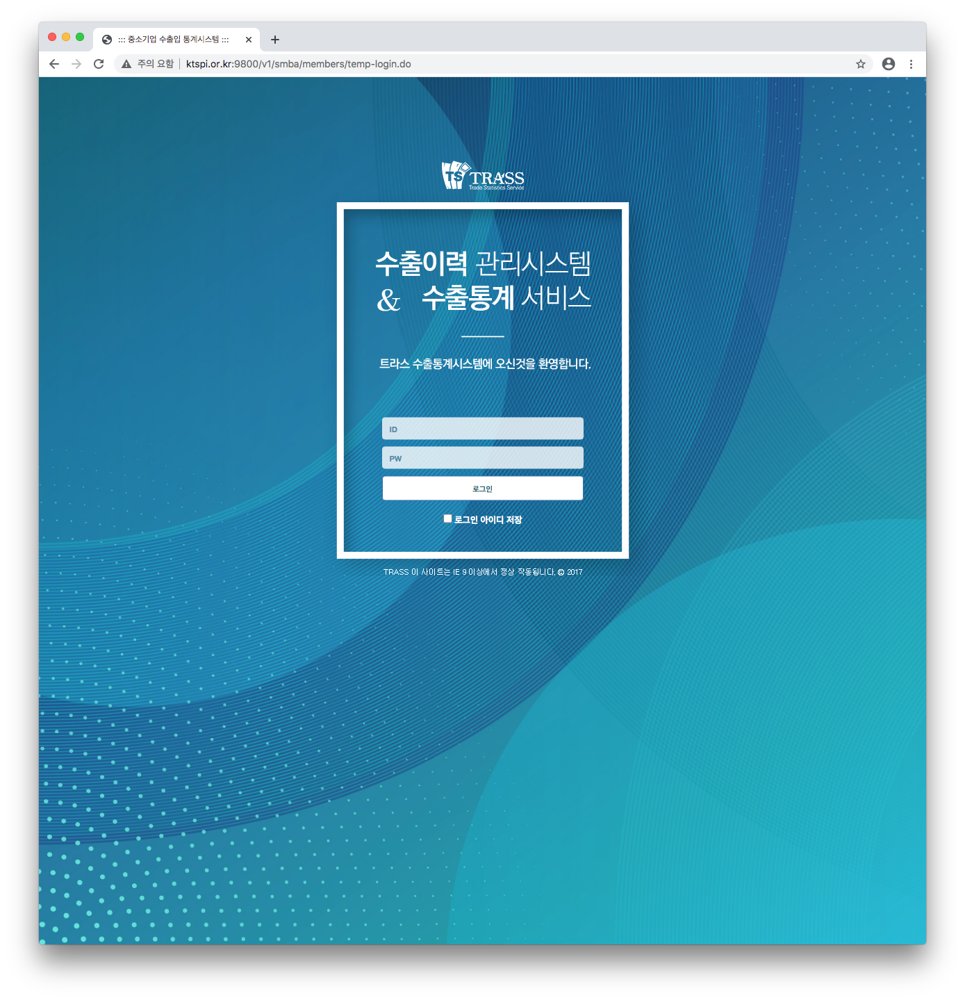
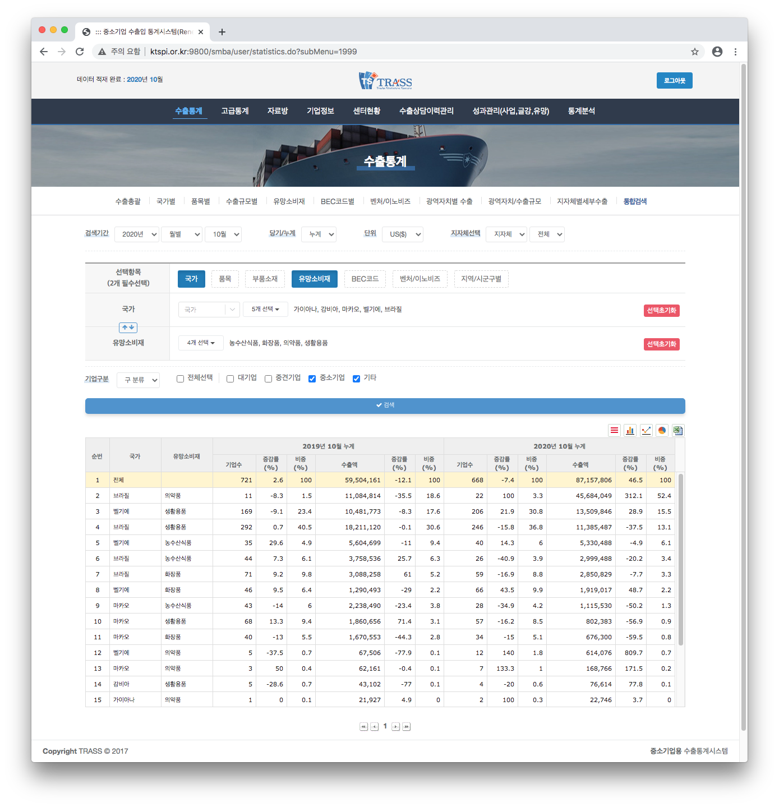
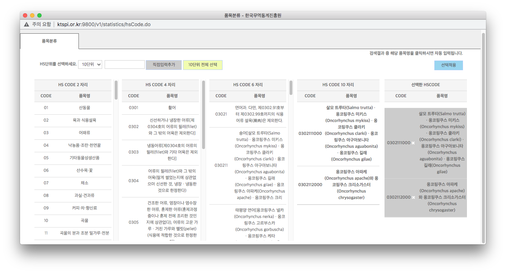
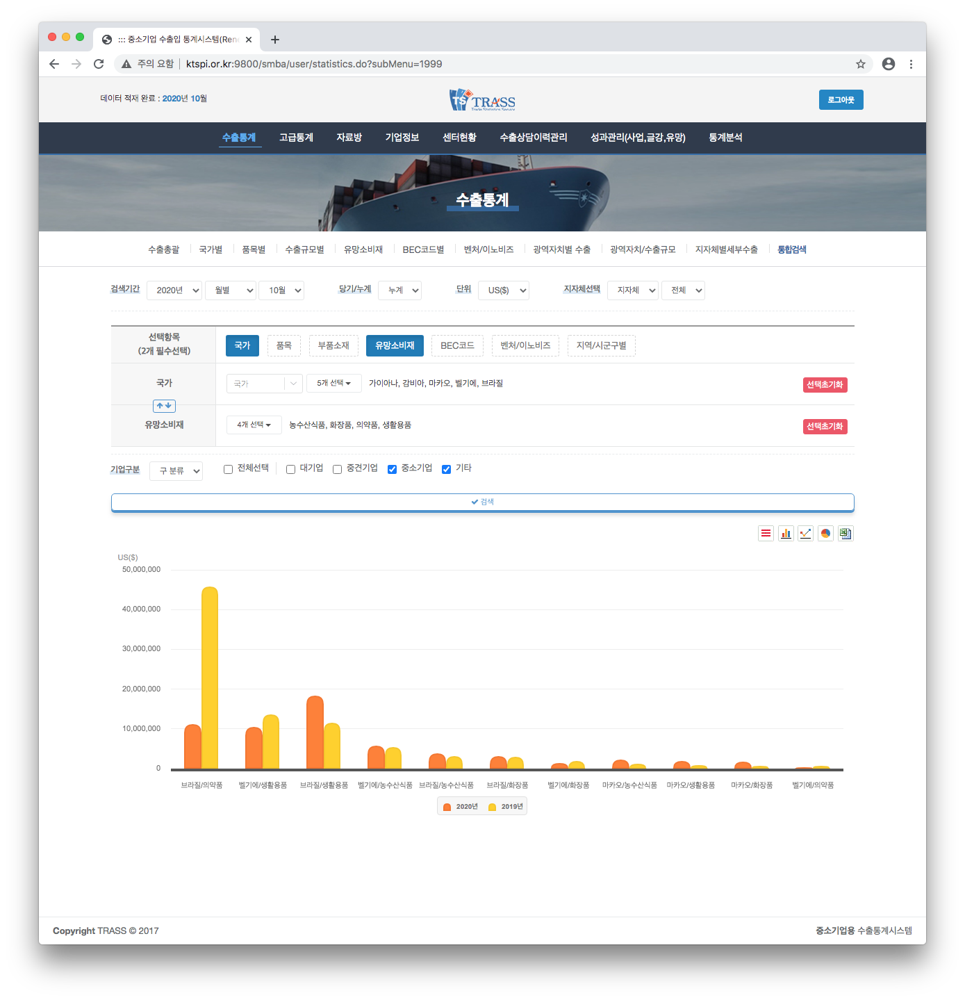
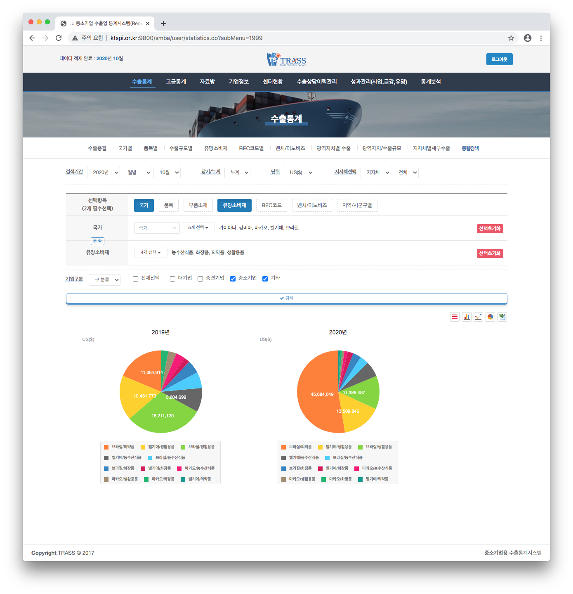
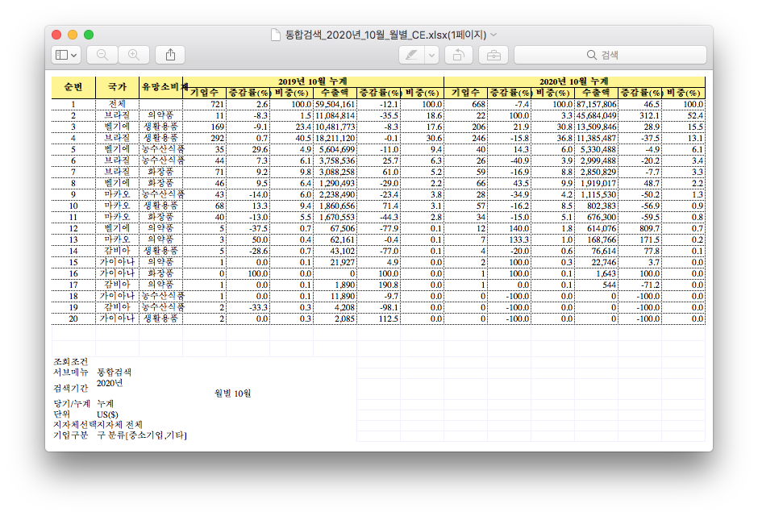
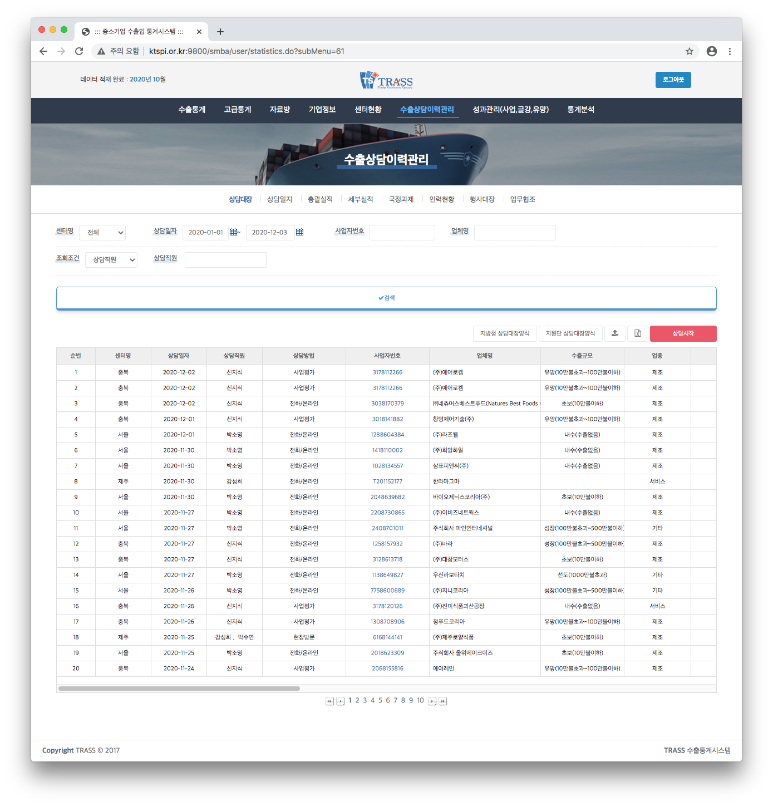
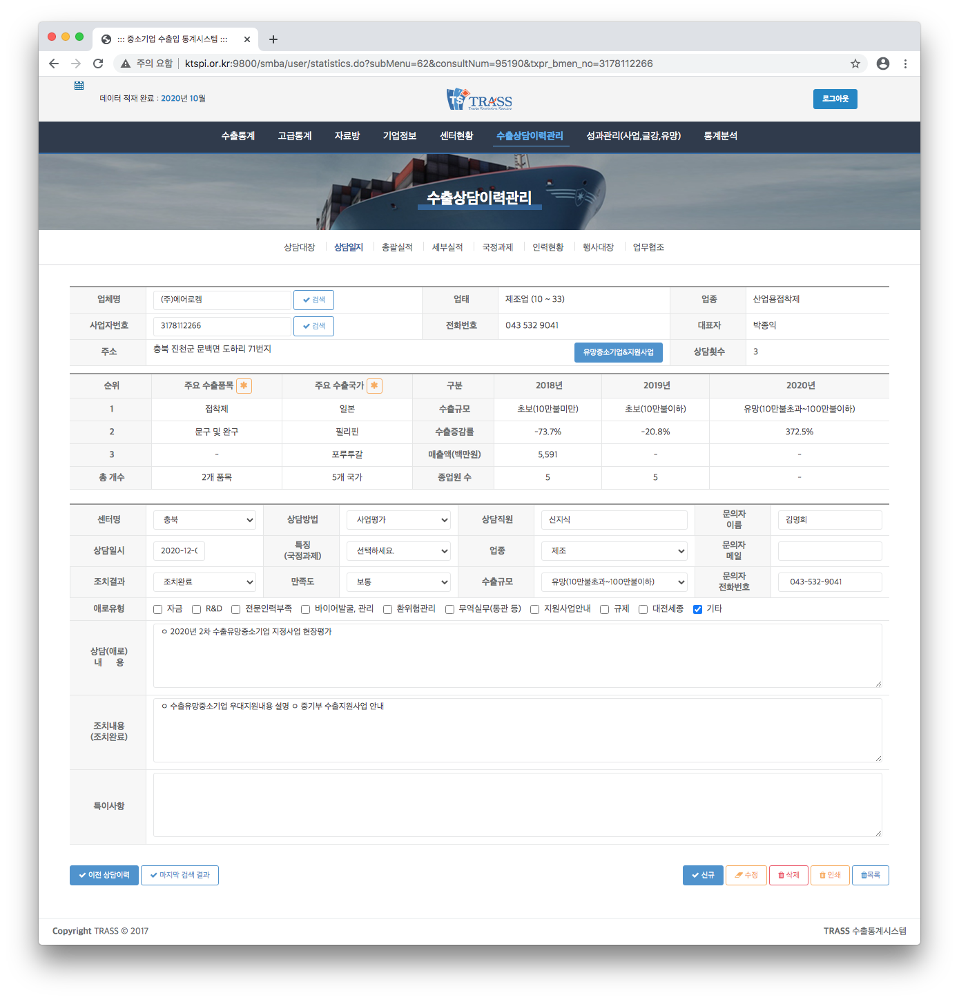
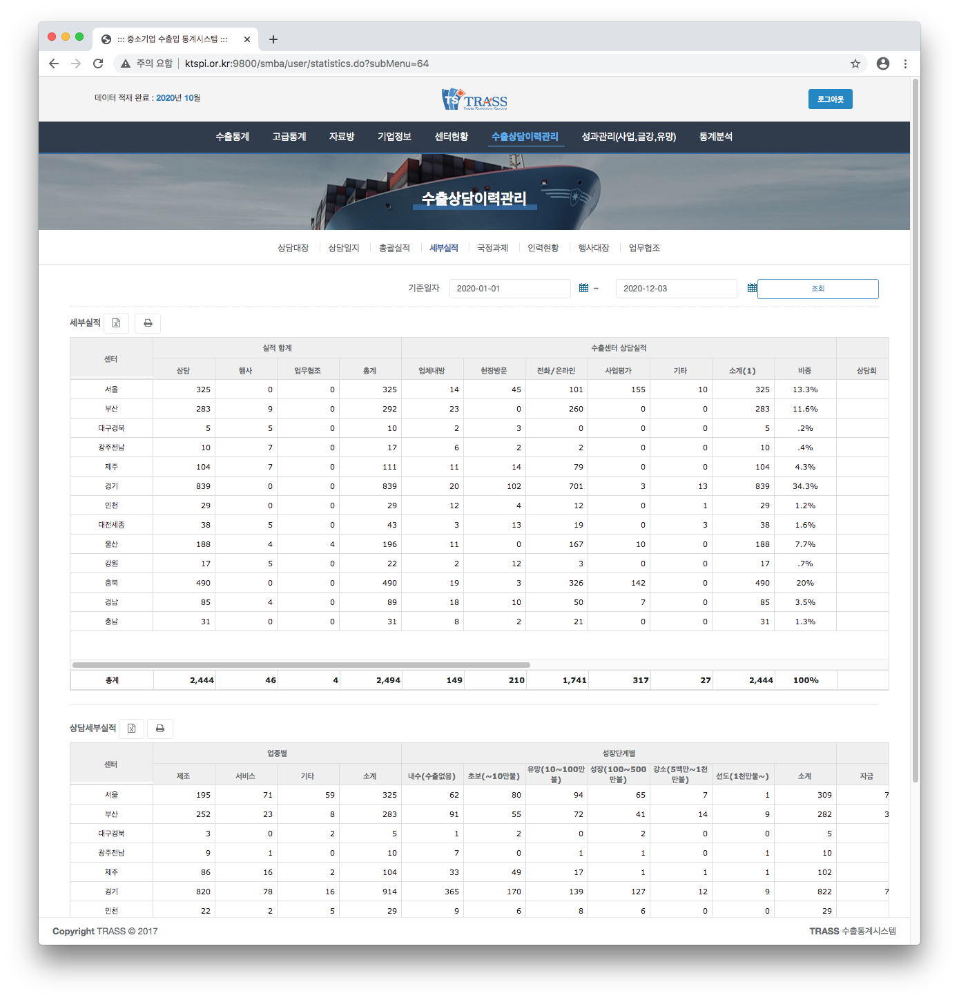

## 2. 중소벤처기업부 수출통계시스템
본 시스템은 관세청에 신고된 수출입 통관 데이터를 분석하여 각 중소기업별 다각적 수출통계 지표, 행정적 실적관리를 제공함으로서 국내 중소벤처기업 진흥을 위한 인사이트를 발굴한다. 주요 서비스 및 목표는 다음과 같다.

> 1. `국가별`, `품목별`, `지역별`, `기업별` 등의 다각적 수출 통계 지표를 산출 및 데이터를 제공한다.
> 2. 중소기업 `수출 지원 상담` 및 `수출 지원 사업`에 대한 업무실적 통계 및 데이터 분석 제공을 통해 행정·사업 실적관리를 지원한다.

* 기간 : 2020.04 ~ 2021.03
* 기술 : Linux, Java, Spring Framework, JSP, jQuery, MyBatis, Tomcat, Oracle
* 역할
    - 중소벤처기업부 수출통계 시스템 개발 및 운영
    - 데이터 통계 API 및 SQL 개발
    - 통합검색 기능 개발

### 화면
#### 로그인

 

#### 수출통계

#### 행정적 실적관리

